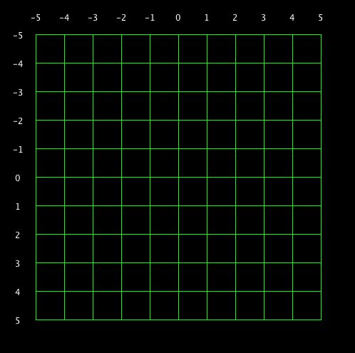

# TU850 Data Centric Programming 2025 - SEMESTER 1

```
Welcome to the Metaverse
```


## Assessment
- 15% Weekly submissions
- 15% Lab Test
- 20% Assignment
- 50% Exam

# Resources
- [CSResources git repo](https://github.com/skooter500/csresources/blob/main/git_ref.pdf). Here you will find links to the previous courses and all my quick references
- [Git for poets](https://www.youtube.com/watch?v=BCQHnlnPusY)
- [Python a Crash Course](https://khwarizmi.org/wp-content/uploads/2021/04/Eric_Matthes_Python_Crash_Course_A_Hands.pdf)

What you will need to install:

- Python
- Java
- VSCode
- Git


## Week 1 - Introduction to the Course
### Instructions
- Check out [the Processing reference](https://processing.org/reference/)
- Check out [The Coding Train](https://www.youtube.com/channel/UCvjgXvBlbQiydffZU7m1_aw)
- Check out [these Sci-Fi user interfaces made by OOP students](https://www.youtube.com/playlist?list=PL1n0B6z4e_E5RZYrubD2pcxq0qzGy-3vr)
- Check out [these music visualisers made in Processing by previous programming students](https://www.youtube.com/watch?v=NGQbYEESZEg&list=PL1n0B6z4e_E7I2bIWWpH8NAa6kPx95sw5)
- If you are curious, check out [some of my creature videos](https://www.youtube.com/watch?v=cW8s5i9dmqA&list=PL1n0B6z4e_E6jErrS0ScSCaVrN7KV729x)
- Look up the following methods in the Processing reference to make sure you are clear about the syntax and parameters:
    - noStroke
    - noFill
    - line
    - ellipse
    - rect
    - background
    - stroke
    - fill
    - size
    - arc
    - triangle

Write sketches to draw the following shape:


[](https://www.youtube.com/watch?v=kPOFqXsLLeo)

These require ONE loop:


This shape draws lines from the sides that all meet in the middle. This can be done using one loop, but is better with two:


This sketch always draws 10 equally sized circles across the screen. This should work no matter what you set the screen size to. You should also declare a variable to hold the number of circles to draw so that if you change this number, the sketch should still work:


This sketch places circles around the outside of a bigger circle to make a flower pattern. Once you figure this out, you can modify it to do something cool with colours:


This sketch prints the numbers of the clock around in a circle:


This sketch requires you to put one loop inside another and also use a boolean variable, though there are other ways to do this:


This is what it looks like when all the above code is in one sketch:


Try and draw this using ONE for loop:



Write a sketch that can draw regular polygons like squares, pentagons, octogons etc:


Write a sketch that can draw stars like these:

